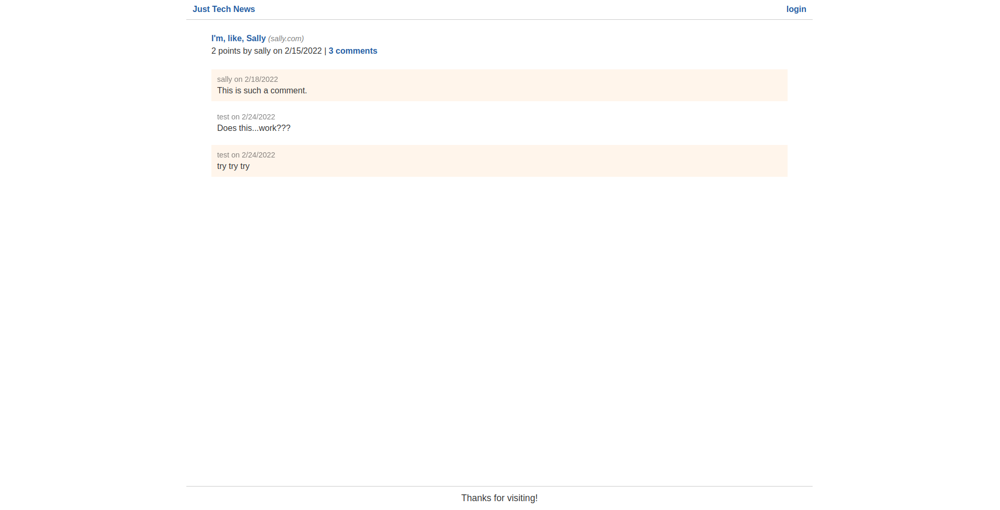

# Just Tech News

A tech news website where users can post, upvote, and comment on links to news articles. 

## Screenshots

## Built With
* HTML
* CSS
* JavaScript
* Express.js
* Handlebars.js
* SQL/MySQL
* Sequelize
* bcrypt

## Website
https://thawing-brook-41305.herokuapp.com/

## What I Learned
* Implementing Sequelize ORM in a Node.js application
* Defining models that use datatype validations
* Implementing CRUD methods with Sequelize
* Implementing Sequlize associations to join one or more tables
* Configuring Heroku for deployment of an application using Sequelize and MySQL
* Using bcrypt for hashing password information 
* Using environment varaibles to protect sensitive data
* Rendering dynamic HTML using handlebars.js template engine
* MVC modularization in a full-stack web application
* Configuring Heroku for deployment using a MySQL database
* Implementing user authentication

